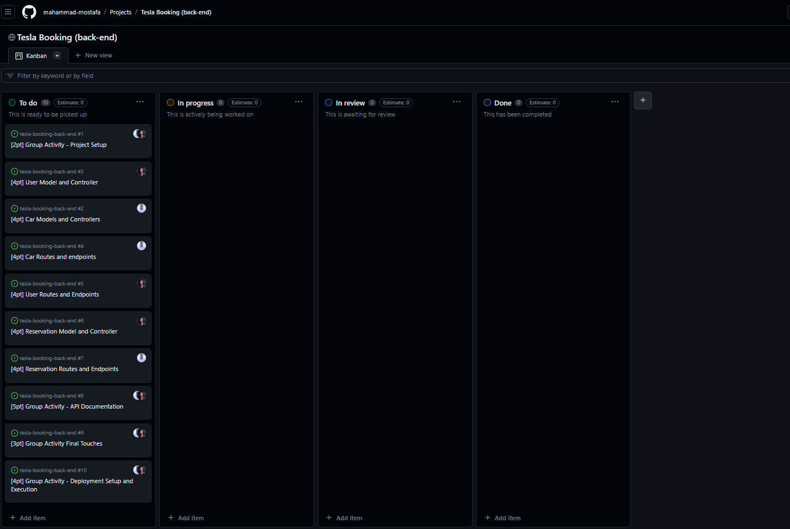
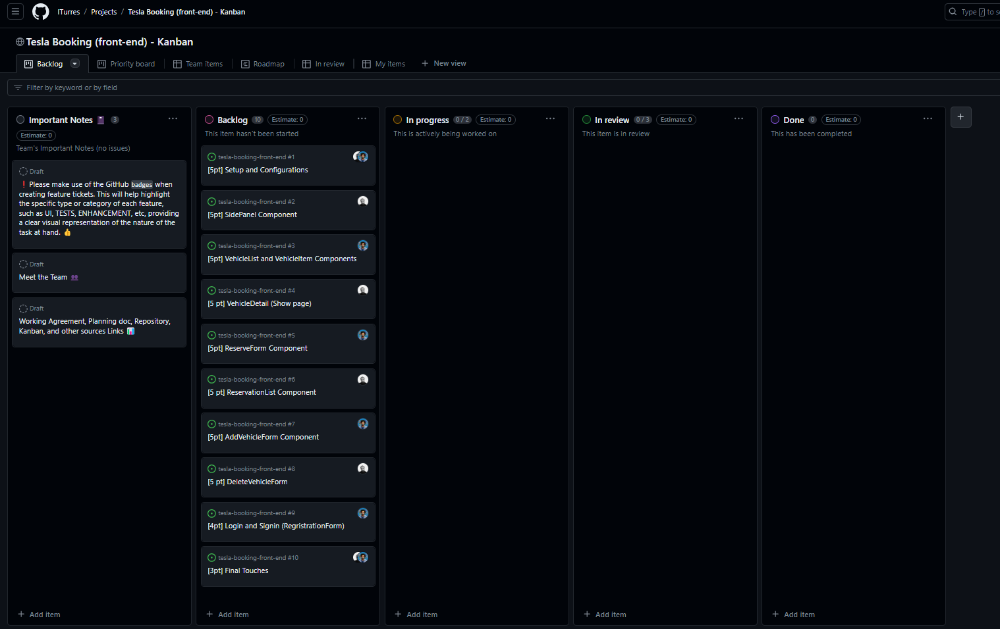

<a name="readme-top"></a>

<div align="center">
    
    <h2><b>Tesla | Book a Ride App</b></h2>
</div>

---

<!-- TABLE OF CONTENTS -->

# 📗 Table of Contents

- [📖 Tesla Booking Backend](#-about-project-)
  - [🛠 Built With](#-built-with-)
    - [Key Features](#-key-features-)
    - [Documentation](#-documentation-)
      - [🚀 Live Demo](#-live-demo-)
      - [Link to Frontend](#-link-to-frontend-)
  - [💻 Getting Started](#-getting-started-)
  - [👥 Authors](#-authors-)
  - [🔭 Future Features](#-future-features-)
  - [🤝 Contributing](#-contributing-)
  - [⭐️ Show your support](#️-show-your-support-)
  - [🙏 Acknowledgments](#-acknowledgments-)
  - [📝 License](#-license-)

<!-- PROJECT DESCRIPTION -->

## About the project <a name="-about-project"></a>

# 📖 Tesla Booking Backend <a name="-about-project-"></a>

**Tesla Booking Backend** is the rails only api app for the full stack tesla booking app. It provides all the endpoints for the [frontend](https://github.com/ITurres/tesla-booking-front-end) to consume. Here the logic for the app is implemented.

- [Tesla Booking Frontend Kanban Board](https://github.com/users/ITurres/projects/6/views/1)
  
- [Tesla Booking Backend Kanban Board](https://github.com/users/mahammad-mostafa/projects/4)
  

### **Team Members**

- Demes Abera Ameneshoa - GitHub: [@demesameneshoa](https://github.com/demesameneshoa)
- Fatema Nazari [@78fatemanazari](https://github.com/78fatemanazari)
- Arthur Emanuel G. Iturres [@ITurres](https://github.com/ITurres)
- Mahammad Mostafa [@mahammad-mostafa](https://github.com/mahammad-mostafa)

### **ER Diagram**

The API is designed as per the ER Diagram shown below which dictates the association of models and their relationships.


## 🛠 Built With <a name="built-with"></a>

### Tech Stack <a name="tech-stack"></a>

<ul>
  <li>
    <a href="https://www.ruby-lang.org/en/">
      
      Ruby
    </a>
  </li>
  <li>
    <a href="https://rubyonrails.org/">
      
      Rails
    </a>
  </li>
  <li>
    <a href="https://www.postgresql.org/">
      
      PostgreSQL
    </a>
  </li>
</ul>
  
<!-- Features -->

### Key Features <a name="-key-features-"></a>

- [x] **Ruby on Rails As an API**.
- [x] **Postgres Database**.
- [x] **API Routed to Provide Response for Requests**.
- [x] **Git Version Control**.
- [x] **User Authentication Managed by Devise**.
- [x] **JWT Token as Authorization Key**.
- [x] **Models Associations**.
- [x] **API Documentation**.

<p align="right">(<a href="#readme-top">back to top</a>)</p>

## API Documentation <a name="-documentation-"></a>

- You can view the input json and response json formats and also you can interact with the API database to visualize the input and output flow of requests and responses.
- [Api docs](https://tesla-booking-api-x2xe.onrender.com/api-docs)

## Live Demo <a name="-live-demo-"></a>

- [API URL](https://tesla-booking-api-x2xe.onrender.com)

## 🎨 Link to Frontend <a name="link-to-frontend"></a>

- [Frontend](https://github.com/ITurres/tesla-booking-front-end)

<p align="right">(<a href="#readme-top">back to top</a>)</p>

<!-- GETTING STARTED -->

## 💻 Getting Started <a name="getting-started"></a>

To get a local copy up and running, follow these steps.

### Prerequisites

In order to run this project you need:

```sh
 mkdir tesla-booking-api
 cd tesla-booking-api
```

### Setup

Clone this repository to your desired folder:

- With SSH:

```bash
  cd my-folder
  git clone git@github.com:mahammad-mostafa/tesla-booking-back-end.git
```

- With HTTPS:

```bash
  cd my-folder
  git clone https://github.com/mahammad-mostafa/tesla-booking-back-end.git
```

- With GitHub CLI:

```bash
  cd my-folder
  gh repo clone mahammad-mostafa/tesla-booking-back-end
```

### Database setup

Connect to your local postgres database:

```bash
  Inside the config/database.yml file add your

  POSTGRES_USER=<username>
  POSTGRES_PASSWORD=<password>

```

### Install

Install this project with:

```bash
  cd tesla-booking-back-end
  bundle install
  rails db:create - create the database
  rails db:migrate - run pending migrations for the current environment.
  rails db:seed
```

### Usage

To run the project, execute the following command:

```bash
  rails server - Starts the development server
  rails console - Starts the interactive command line
```

<p align="right">(<a href="#readme-top">back to top</a>)</p>

<!-- AUTHORS -->

## Authors <a name="-authors-"></a>

👤 **Demes Ameneshoa**

- GitHub: [@demesameneshoa](https://github.com/demesameneshoa)
- Twitter: [@demesabera](https://twitter.com/demesabera)
- LinkedIn: [demesameneshoa](https://www.linkedin.com/in/demesameneshoa/)

👤 **Fatema Nazari**

- GitHub: [@78fatemanazari](https://github.com/78fatemanazari)
- Twitter: [@fati_nazari78](https://twitter.com/fati_nazari78?s=31)
- LinkedIn: [78fatemanazari](https://www.linkedin.com/in/78fatemanazari)

<p align="right">(<a href="#readme-top">back to top</a>)</p>

<!-- FUTURE FEATURES -->

## 🔭 Future Features <a name="future-features"></a>

- [ ] Unit Tests
- [ ] Add More Endpoints
- [ ] Add Users Role Based Access

<p align="right">(<a href="#readme-top">back to top</a>)</p>

<!-- CONTRIBUTING -->

## 🤝 Contributing <a name="contributing"></a>

Contributions, issues, and feature requests are welcome!

Feel free to check the [issues page](https://github.com/mahammad-mostafa/tesla-booking-back-end/issues).

<p align="right">(<a href="#readme-top">back to top</a>)</p>

<!-- SUPPORT -->

## ⭐️ Show your support <a name="support"></a>

If you like this project please leave a star 🤩

<p align="right">(<a href="#readme-top">back to top</a>)</p>

<!-- ACKNOWLEDGEMENTS -->

## 🙏 Acknowledgments <a name="acknowledgements"></a>

We would like to acknowledge the Microverse community and the staff for their incredible support through out our journey.

- [Microverse](https://www.microverse.org/)

<p align="right">(<a href="#readme-top">back to top</a>)</p>

<!-- LICENSE -->

## 📝 License <a name="license"></a>

This project is [MIT](./LICENSE) licensed.

<p align="right">(<a href="#readme-top">back to top</a>)</p>

---
